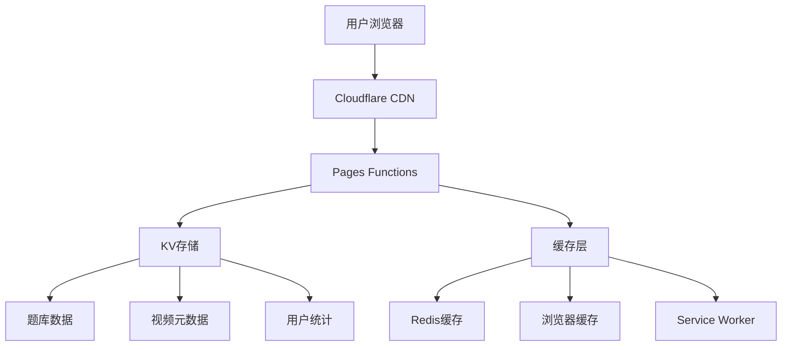

# 安全管理交互页面项目规划

## 项目概述

本项目是一个基于现代Web技术的安全管理交互式学习平台，采用Cloudflare Pages + Functions的无服务器架构。项目旨在通过视频学习和知识测试相结合的方式，提升用户的安全意识和操作规范。

### 核心功能
- **🎥 视频学习模块**：沉浸式安全教育视频，对比展示标准操作与违规行为
- **📝 智能测试系统**：基于AI算法的题目推荐，个性化学习路径
- **📊 数据分析平台**：实时学习效果追踪，多维度数据可视化
- **🔧 内容管理系统**：灵活的题库和视频内容管理

### 技术特色
- **边缘计算架构**：基于Cloudflare全球网络，毫秒级响应
- **渐进式Web应用**：支持离线使用，原生应用体验
- **自适应设计**：智能适配各种设备和网络环境
- **安全优先**：企业级安全防护，数据隐私保护

## 页面结构

应用包含以下5个页面，形成完整的安全学习和测试流程：

### 学习模块

1. **视频页面1**：《你的选择决定安全分界-遵守规章制度-安全》
   - 全屏播放预设视频，展示正确安全操作流程
   - 在移动设备上自动全屏播放，优化移动端体验
   - 视频结束后提供导航至测试页面的选项

2. **视频页面2**：《你的选择决定安全分界-违规操作-不安全》
   - 全屏播放预设视频，展示违规操作的危险性
   - 在移动设备上自动全屏播放，确保良好观看体验
   - 视频结束后提供导航至测试页面的选项

### 测试模块

3. **答题页面1**：《测测你的主动安全意识有多强-按章操作》
   - 包含10道安全意识测试题（从KV存储的题库中随机抽取）
   - 实时反馈答题正确性，增强学习效果
   - 满分时显示恭喜特效，强化正面激励

4. **答题页面2**：《测测你的主动安全意识有多强-违规操作》
   - 包含10道安全意识测试题（从KV存储的题库中随机抽取）
   - 题目侧重于识别和规避违规操作
   - 规避违章成功满分时显示恭喜特效，强化安全意识

### 管理模块

5. **管理页面**：位于`/admin`路径
   - 提供题库管理（增删查改），便于内容更新
   - 提供视频链接管理，支持更换视频源
   - 查看访问统计数据，分析学习效果
   - 需要基本认证保护，确保管理安全

## 技术架构

### 架构设计原则
- **性能优先**：边缘计算 + 智能缓存，全球毫秒级响应
- **安全可靠**：多层安全防护，企业级数据保护
- **易于维护**：模块化设计，清晰的代码结构
- **可扩展性**：支持功能模块热插拔，便于后续扩展

### 前端技术栈

- **核心框架**：原生ES6+ JavaScript + Web Components，零依赖轻量化
- **架构模式**：SPA + 模块化路由，组件化开发
- **样式方案**：CSS3 + CSS Custom Properties，支持主题切换
- **响应式设计**：Mobile-First + CSS Grid/Flexbox，全设备适配
- **PWA增强**：Service Worker + Web App Manifest，原生应用体验
- **性能优化**：代码分割 + 懒加载 + 资源预加载

### 后端服务架构

- **计算层**：Cloudflare Pages Functions (V8 Isolates)
- **存储层**：Cloudflare KV (全球分布式键值存储)
- **缓存层**：Cloudflare CDN + 浏览器缓存 + Service Worker缓存
- **安全层**：JWT认证 + CSRF防护 + Rate Limiting
- **监控层**：Cloudflare Analytics + 自定义埋点

### 数据架构



## 项目文件结构

### 设计原则
- **简洁高效**：扁平化目录结构，减少嵌套层级
- **职责分离**：按功能模块组织，便于团队协作
- **构建友好**：支持现代构建工具和CI/CD流程
- **可维护性**：清晰的命名规范和文档结构

### 优化后的目录结构

```
anq/                                 # 项目根目录 (简化命名)
├── .github/                         # GitHub配置
│   ├── workflows/                   # CI/CD工作流
│   │   ├── deploy.yml               # 部署流水线
│   │   ├── test.yml                 # 测试流水线
│   │   └── security.yml             # 安全扫描
│   └── templates/                   # Issue/PR模板
├── docs/                            # 项目文档
│   ├── api.md                       # API文档
│   ├── deployment.md                # 部署指南
│   ├── development.md               # 开发指南
│   └── architecture.md              # 架构设计文档
├── src/                             # 源代码目录
│   ├── pages/                       # 页面文件
│   │   ├── index.html               # 首页
│   │   ├── video/                   # 视频页面
│   │   │   ├── safety.html          # 安全操作视频
│   │   │   └── violation.html       # 违规操作视频
│   │   ├── quiz/                    # 测试页面
│   │   │   ├── safety.html          # 安全意识测试
│   │   │   └── violation.html       # 违规识别测试
│   │   └── admin.html               # 管理页面
│   ├── modules/                     # 核心功能模块
│   │   ├── router.js                # 路由系统
│   │   ├── video-player.js          # 视频播放器
│   │   ├── quiz-system.js           # 答题系统
│   │   ├── data-manager.js          # 数据管理
│   │   └── auth-manager.js          # 认证管理
│   ├── components/                  # UI组件
│   │   ├── modal.js                 # 模态框
│   │   ├── progress-bar.js          # 进度条
│   │   ├── notification.js          # 通知组件
│   │   └── loader.js                # 加载器
│   ├── utils/                       # 工具函数
│   │   ├── api.js                   # API请求
│   │   ├── storage.js               # 存储管理
│   │   ├── validation.js            # 数据验证
│   │   └── helpers.js               # 通用工具
│   ├── styles/                      # 样式文件
│   │   ├── base/                    # 基础样式
│   │   │   ├── reset.css            # 样式重置
│   │   │   ├── variables.css        # CSS变量
│   │   │   └── typography.css       # 字体排版
│   │   ├── components/              # 组件样式
│   │   ├── pages/                   # 页面样式
│   │   └── main.css                 # 主样式文件
│   ├── assets/                      # 静态资源
│   │   ├── images/                  # 图片资源
│   │   │   ├── icons/               # 图标
│   │   │   ├── backgrounds/         # 背景图
│   │   │   └── illustrations/       # 插图
│   │   └── fonts/                   # 字体文件
│   └── data/                        # 初始数据
│       ├── questions/               # 题库数据
│       ├── videos.json              # 视频配置
│       └── config.json              # 应用配置
├── functions/                       # Cloudflare Functions
│   ├── api/                         # API路由
│   │   ├── questions/               # 题目API
│   │   │   ├── [type].js            # 按类型获取题目
│   │   │   └── random.js            # 随机题目
│   │   ├── videos/                  # 视频API
│   │   │   └── [id].js              # 视频信息
│   │   ├── stats/                   # 统计API
│   │   │   ├── index.js             # 公开统计
│   │   │   └── track.js             # 行为追踪
│   │   └── admin/                   # 管理API
│   │       ├── auth.js              # 认证
│   │       ├── questions.js         # 题目管理
│   │       ├── videos.js            # 视频管理
│   │       └── analytics.js         # 数据分析
│   ├── _middleware.js               # 全局中间件
│   └── lib/                         # 共享库
│       ├── auth.js                  # 认证工具
│       ├── cache.js                 # 缓存管理
│       ├── validation.js            # 数据验证
│       └── response.js              # 响应工具
├── public/                          # 静态资源
│   ├── manifest.json                # PWA配置
│   ├── sw.js                        # Service Worker
│   ├── _headers                     # Cloudflare Headers
│   └── _redirects                   # 重定向规则
├── tests/                           # 测试文件
│   ├── unit/                        # 单元测试
│   ├── integration/                 # 集成测试
│   ├── e2e/                         # 端到端测试
│   └── fixtures/                    # 测试数据
├── scripts/                         # 构建脚本
│   ├── build.js                     # 构建脚本
│   ├── dev.js                       # 开发服务器
│   ├── setup-kv.js                  # KV初始化
│   └── deploy.js                    # 部署脚本
├── config/                          # 配置文件
│   ├── build.config.js              # 构建配置
│   ├── env.config.js                # 环境配置
│   └── cache.config.js              # 缓存配置
├── .env.example                     # 环境变量示例
├── .gitignore                       # Git忽略文件
├── .eslintrc.js                     # ESLint配置
├── .prettierrc                      # Prettier配置
├── wrangler.toml                    # Cloudflare配置
├── package.json                     # 项目配置
├── README.md                        # 项目说明
└── CHANGELOG.md                     # 更新日志
```

### 文件结构优化说明

1. **简化层级**：减少不必要的嵌套，提高开发效率
2. **功能聚合**：相关功能文件就近放置，便于维护
3. **构建友好**：支持现代构建工具的最佳实践
4. **部署优化**：针对Cloudflare Pages优化的目录结构

## 核心功能模块

### 模块设计原则
- **单一职责**：每个模块专注特定功能领域
- **松耦合**：模块间通过标准接口通信
- **高内聚**：相关功能集中在同一模块内
- **可测试**：支持单元测试和集成测试

### 1. 路由系统 (router.js)

现代化的前端路由系统，提供流畅的单页应用体验：

**核心特性**：
- 基于History API的无刷新页面切换
- 支持路由参数和查询字符串解析
- 页面状态保存和恢复机制
- 路由守卫和权限控制
- 页面切换动画和加载状态

**API设计**：

```javascript
// 路由配置
const routes = {
  '/': { component: 'HomePage', title: '安全学习平台' },
  '/video/safety': { component: 'VideoPage', title: '安全操作视频', auth: false },
  '/video/violation': { component: 'VideoPage', title: '违规操作视频', auth: false },
  '/quiz/safety': { component: 'QuizPage', title: '安全意识测试', auth: false },
  '/quiz/violation': { component: 'QuizPage', title: '违规识别测试', auth: false },
  '/admin': { component: 'AdminPage', title: '管理后台', auth: true }
};

// 路由器类
class Router {
  constructor(routes, options = {}) {
    this.routes = routes;
    this.currentRoute = null;
    this.guards = [];
    this.init();
  }

  // 初始化路由系统
  init() {
    window.addEventListener('popstate', this.handlePopState.bind(this));
    this.navigate(window.location.pathname, { replace: true });
  }

  // 导航到指定路径
  async navigate(path, options = {}) {
    const route = this.routes[path];
    if (!route) {
      return this.handleNotFound(path);
    }

    // 执行路由守卫
    const guardResult = await this.executeGuards(route, path);
    if (!guardResult.allowed) {
      return this.handleGuardRejection(guardResult);
    }

    // 更新浏览器历史
    if (!options.replace) {
      history.pushState({ path }, route.title, path);
    }

    // 加载页面组件
    await this.loadComponent(route.component, path);
    this.currentRoute = { path, route };
  }

  // 添加路由守卫
  addGuard(guard) {
    this.guards.push(guard);
  }

  // 执行路由守卫
  async executeGuards(route, path) {
    for (const guard of this.guards) {
      const result = await guard(route, path);
      if (!result.allowed) {
        return result;
      }
    }
    return { allowed: true };
  }
}
```

### 2. 视频播放模块 (video-player.js)

智能化的视频播放系统，提供优质的学习体验：

**核心特性**：
- 自适应视频质量和网络状况
- 全屏播放和画中画模式支持
- 智能预加载和缓存策略
- 播放进度追踪和断点续播
- 多设备同步和跨平台兼容
- 视频分析和学习效果统计

**性能优化**：
- 视频分片加载，减少初始加载时间
- 根据网络状况自动调整视频质量
- 智能预加载下一个视频内容
- 离线缓存支持，提升用户体验

#### 函数设计

```javascript
/**
 * 获取视频URL
 * @param {string} videoId - 视频ID标识符
 * @returns {Promise<string>} - 视频URL
 */
async function getVideoUrl(videoId) {
  // 从API获取视频URL
  // 验证URL有效性
  // 返回有效URL或默认URL（当存储中无数据时）
  const response = await fetch(`/api/videos/${videoId}`);
  const data = await response.json();
  return data.url;
}

/**
 * 初始化视频播放器
 * @param {string} videoId - 视频元素ID
 * @param {string} videoUrl - 视频URL
 * @param {Function} onEnded - 视频结束回调函数
 * @returns {HTMLElement} - 初始化后的视频元素
 */
function initVideoPlayer(videoId, videoUrl, onEnded) {
  // 获取视频DOM元素
  // 设置视频源和属性（自动播放、循环等）
  // 绑定事件监听器（播放、暂停、结束等）
  // 根据设备类型适配播放器
  // 添加自定义播放控制UI
  // 设置视频结束回调
  // 返回初始化后的视频元素
}

/**
 * 检测设备类型并适配视频播放
 * @param {HTMLElement} videoElement - 视频DOM元素
 * @returns {Object} - 包含设备类型和适配结果的对象
 */
function detectDeviceAndAdapt(videoElement) {
  // 检测设备类型（桌面/平板/手机）
  // 检测屏幕方向（横向/纵向）
  // 检测浏览器对全屏API的支持
  // 根据设备类型调整视频播放器尺寸和控制方式
  // 设置适合当前设备的播放质量
  // 返回设备信息和适配结果
}

/**
 * 切换视频全屏状态
 * @param {HTMLElement} videoElement - 视频DOM元素
 * @param {boolean} fullscreen - 是否全屏
 * @returns {boolean} - 操作是否成功
 */
function toggleFullscreen(videoElement, fullscreen) {
  // 检查全屏API兼容性
  // 根据参数请求进入或退出全屏
  // 处理全屏变化事件
  // 调整UI元素在全屏模式下的显示
  // 返回操作结果
}

/**
 * 处理视频播放结束事件
 * @param {string} videoId - 视频元素ID
 * @param {Function} callback - 回调函数
 */
function handleVideoEnded(videoId, callback) {
  // 显示视频结束UI（重播按钮、下一步选项等）
  // 记录视频完成观看状态
  // 提供相关学习建议
  // 显示导航到测试页面的选项
  // 执行自定义回调函数
}

/**
 * 预加载视频资源
 * @param {string} videoUrl - 视频URL
 * @param {Object} options - 预加载选项
 */
function preloadVideo(videoUrl, options = {}) {
  // 创建预加载请求
  // 设置预加载范围（元数据/部分内容/完整视频）
  // 根据网络状况调整预加载策略
  // 监控预加载进度
}

/**
 * 更新视频链接
 * @param {string} videoId - 视频ID
 * @param {string} videoUrl - 新的视频URL
 * @returns {Promise<boolean>} - 更新是否成功
 */
async function updateVideoUrl(videoId, videoUrl) {
  // 验证URL格式和可访问性
  // 检查视频内容类型
  // 通过API更新视频链接
  // 记录更新操作日志
  const response = await fetch(`/api/admin/videos/${videoId}`, {
    method: 'PUT',
    headers: { 'Content-Type': 'application/json' },
    body: JSON.stringify({ url: videoUrl })
  });
  return response.ok;
}
```

### 3. 答题系统 (quiz-system.js)

答题系统是应用的核心学习评估组件，负责测试用户的安全知识掌握程度：

- **题库管理**：从Cloudflare KV存储中随机抽取10道题目，确保每次测试内容新鲜
- **多题型支持**：支持单选题、多选题和判断题，全面测试安全知识
- **实时反馈**：答题后立即提供正确/错误反馈，增强学习效果
- **进度跟踪**：显示答题进度和剩余题目数量，提供清晰指引
- **计分系统**：智能记录用户得分，区分不同题型的分值
- **结果分析**：详细分析答题情况，提供针对性的安全知识建议
- **满分激励**：达到满分时提供特殊视觉和声音反馈，增强成就感

#### 函数设计

```javascript
/**
 * 初始化答题系统
 * @param {string} quizType - 答题类型（active_safety 或 unauthorized）
 * @param {Object} options - 配置选项（计时、难度等）
 * @returns {Object} - 初始化后的答题系统状态
 */
async function initQuiz(quizType, options = {}) {
  // 从API获取题目数据
  const questions = await fetchQuestions(quizType, options);
  // 验证题目数据完整性
  // 初始化题库和答题状态
  // 设置计时器（如果启用）
  // 随机打乱题目顺序（可选）
  // 创建答题进度跟踪
  // 渲染答题界面框架
  // 显示第一道题目
  // 返回初始化状态
}

/**
 * 从API获取题目
 * @param {string} quizType - 题目类型
 * @param {Object} options - 获取选项
 * @returns {Promise<Array>} - 题目数组
 */
async function fetchQuestions(quizType, options = {}) {
  const params = new URLSearchParams({
    type: quizType,
    count: options.count || 10,
    ...(options.difficulty && { difficulty: options.difficulty })
  });
  
  const response = await fetch(`/api/questions?${params}`);
  const data = await response.json();
  return data.questions;
}

/**
 * 渲染当前题目
 * @param {number} questionIndex - 题目索引
 * @returns {HTMLElement} - 渲染后的题目容器
 */
function renderQuestion(questionIndex) {
  // 获取当前题目数据
  // 确定题目类型（单选/多选/判断）
  // 构建题目标题和描述DOM
  // 创建选项列表，根据题型设置不同样式
  // 添加选项交互效果
  // 绑定选项点击事件处理器
  // 更新答题进度指示器
  // 返回题目容器元素
}

/**
 * 处理用户答题
 * @param {number} questionIndex - 题目索引
 * @param {number|Array} answerIndex - 用户选择的答案索引
 * @returns {Object} - 包含答案正确性和详细反馈的对象
 */
function handleAnswer(questionIndex, answerIndex) {
  // 获取当前题目和正确答案
  // 根据题型验证答案正确性
  // 计算本题得分
  // 更新用户答题记录和总分
  // 显示答案正确性反馈
  // 如果答错，显示正确答案和解释
  // 启用"下一题"按钮
  // 记录答题时间
  // 返回包含答题结果的对象
}

/**
 * 导航到下一题
 * @returns {Object} - 包含下一题状态的对象
 */
function nextQuestion() {
  // 保存当前题目的答题状态
  // 更新当前题目索引
  // 检查是否为最后一题
  // 如果还有题目，渲染下一题
  // 如果已完成所有题目，准备显示结果
  // 更新进度指示器
  // 返回包含下一题状态的对象
}

/**
 * 计算并显示最终得分
 * @returns {Object} - 包含详细得分数据和分析的对象
 */
function calculateAndShowResult() {
  // 计算总分和百分比
  // 分析答题情况（正确题数、错误题数、用时）
  // 生成针对性的反馈和建议
  // 渲染结果页面，显示详细得分
  // 检查是否达到满分
  // 如果满分，触发满分特效
  // 提供重新测试和查看错题选项
  // 保存答题记录到本地存储
  // 提交成绩到服务器（可选）
  // 返回包含详细结果的对象
}

/**
 * 重置答题状态
 * @param {boolean} newQuestions - 是否获取新题目
 * @returns {Promise<boolean>} - 重置是否成功
 */
async function resetQuiz(newQuestions = false) {
  // 清除当前答题记录和状态
  // 重置得分和计时器
  // 如果需要新题目，从服务器获取
  // 重新初始化答题系统
  // 返回第一题
  // 返回重置结果
}
```

### 4. 数据管理模块 (data-manager.js)

数据管理模块负责应用数据的存储、检索和同步：

- **本地数据管理**：使用localStorage和sessionStorage管理用户状态
- **API通信**：与Cloudflare Pages Functions进行数据交互
- **缓存策略**：实现智能缓存，减少网络请求
- **离线支持**：提供离线数据访问和同步功能
- **数据验证**：确保数据完整性和安全性

#### 函数设计

```javascript
/**
 * 初始化应用数据
 * @param {Object} options - 初始化选项
 * @returns {Object} - 初始化后的用户数据
 */
function initAppData(options = {}) {
  // 创建默认数据结构
  // 生成唯一会话ID（使用UUID v4）
  // 检测设备信息（类型、浏览器、操作系统）
  // 尝试从localStorage加载已有数据
  // 验证数据完整性和版本兼容性
  // 合并默认数据和已保存数据
  // 记录首次/最近访问时间
  // 增加访问计数
  // 初始化用户偏好设置
  // 返回完整的用户数据对象
}

/**
 * 保存应用数据到本地存储
 * @param {Object} data - 要保存的数据
 * @param {Object} options - 保存选项
 * @returns {boolean} - 保存是否成功
 */
function saveAppData(data, options = {}) {
  // 验证数据完整性
  // 选择性保存（可只更新部分数据）
  // 序列化数据（可选压缩）
  // 处理存储限制（分块存储大数据）
  // 设置数据过期时间
  // 保存到localStorage
  // 返回保存结果
}

/**
 * 从API获取随机题目
 * @param {string} questionType - 题库类型
 * @param {Object} options - 抽取选项
 * @returns {Promise<Array>} - 随机抽取的题目数组
 */
async function getRandomQuestions(questionType, options = {}) {
  // 设置默认选项（题目数量、难度范围等）
  // 构建API请求参数
  // 发送请求到Pages Functions
  // 处理响应和错误
  // 验证返回的题目数据
  // 记录已抽取题目ID，避免短期内重复
  // 返回格式化后的题目数组
}

/**
 * 记录用户行为数据
 * @param {string} action - 行为类型
 * @param {Object} data - 行为数据
 * @returns {Promise<boolean>} - 记录是否成功
 */
async function logUserAction(action, data = {}) {
  // 获取用户会话ID和设备信息
  // 创建行为记录对象
  // 添加时间戳和上下文信息
  // 发送到统计API
  // 处理响应和错误
  // 返回记录结果
}

/**
 * 更新用户进度
 * @param {string} type - 进度类型（video/quiz）
 * @param {string} id - 内容ID
 * @param {Object} progress - 进度数据
 * @returns {Object} - 更新后的进度
 */
function updateUserProgress(type, id, progress) {
  // 获取当前用户数据
  // 验证进度数据
  // 更新对应的进度记录
  // 检查是否完成学习目标
  // 更新成就和统计
  // 保存更新后的数据
  // 返回更新后的进度
}
```

### 5. UI组件系统 (ui-components.js)

UI组件系统提供可复用的界面组件，确保界面一致性和开发效率：

- **模态框组件**：用于显示重要信息和确认操作
- **进度条组件**：显示学习和答题进度
- **通知组件**：提供用户反馈和状态提示
- **加载组件**：显示数据加载状态
- **表单组件**：统一的表单输入和验证

#### 函数设计

```javascript
/**
 * 创建模态框
 * @param {Object} options - 模态框配置
 * @returns {Object} - 模态框控制对象
 */
function createModal(options = {}) {
  // 创建模态框DOM结构
  // 设置标题、内容和按钮
  // 添加动画效果
  // 绑定事件处理器
  // 返回控制对象（显示、隐藏、更新）
}

/**
 * 创建进度条
 * @param {HTMLElement} container - 容器元素
 * @param {Object} options - 进度条配置
 * @returns {Object} - 进度条控制对象
 */
function createProgressBar(container, options = {}) {
  // 创建进度条DOM结构
  // 设置样式和动画
  // 实现进度更新方法
  // 返回控制对象（更新进度、设置状态）
}

/**
 * 显示通知消息
 * @param {string} message - 消息内容
 * @param {string} type - 消息类型（success/error/warning/info）
 * @param {Object} options - 通知选项
 * @returns {Object} - 通知控制对象
 */
function showNotification(message, type = 'info', options = {}) {
  // 创建通知DOM元素
  // 设置消息内容和样式
  // 添加显示动画
  // 设置自动隐藏定时器
  // 绑定关闭事件
  // 返回控制对象（关闭、更新）
}

/**
 * 创建加载指示器
 * @param {HTMLElement} container - 容器元素
 * @param {Object} options - 加载器配置
 * @returns {Object} - 加载器控制对象
 */
function createLoader(container, options = {}) {
  // 创建加载器DOM结构
  // 设置加载动画
  // 添加加载文本（可选）
  // 返回控制对象（显示、隐藏、更新文本）
}
```

## API架构设计

### RESTful API设计原则
- **资源导向**：URL表示资源，HTTP方法表示操作
- **无状态**：每个请求包含完整的处理信息
- **统一接口**：标准化的请求/响应格式
- **分层系统**：支持缓存、负载均衡等中间层
- **版本控制**：支持API版本演进

### API路由架构

```
/api/v1/
├── questions/                    # 题目资源
│   ├── GET    /safety           # 获取安全题目
│   ├── GET    /violation        # 获取违规题目
│   ├── GET    /random           # 随机题目
│   └── POST   /validate         # 验证答案
├── videos/                      # 视频资源
│   ├── GET    /:id              # 获取视频信息
│   ├── GET    /:id/progress     # 获取播放进度
│   └── POST   /:id/progress     # 更新播放进度
├── analytics/                   # 数据分析
│   ├── GET    /public           # 公开统计
│   ├── POST   /events           # 事件追踪
│   └── GET    /dashboard        # 仪表板数据
└── admin/                       # 管理接口
    ├── auth/                    # 认证管理
    │   ├── POST /login          # 登录
    │   ├── POST /refresh        # 刷新Token
    │   └── POST /logout         # 登出
    ├── questions/               # 题目管理
    │   ├── GET    /             # 题目列表
    │   ├── POST   /             # 创建题目
    │   ├── PUT    /:id          # 更新题目
    │   └── DELETE /:id          # 删除题目
    ├── videos/                  # 视频管理
    │   ├── GET    /             # 视频列表
    │   ├── PUT    /:id          # 更新视频
    │   └── DELETE /:id          # 删除视频
    └── analytics/               # 分析管理
        ├── GET    /overview     # 概览数据
        ├── GET    /users        # 用户分析
        └── GET    /content      # 内容分析
```

### 缓存策略设计

```javascript
// 缓存配置
const cacheConfig = {
  // 题目数据 - 1小时缓存
  questions: {
    ttl: 3600,
    strategy: 'stale-while-revalidate',
    version: 'v1',
    tags: ['questions', 'content']
  },

  // 视频元数据 - 24小时缓存
  videos: {
    ttl: 86400,
    strategy: 'cache-first',
    version: 'v1',
    tags: ['videos', 'content']
  },

  // 统计数据 - 5分钟缓存
  analytics: {
    ttl: 300,
    strategy: 'network-first',
    version: 'v1',
    tags: ['analytics', 'stats']
  },

  // 用户进度 - 实时更新
  progress: {
    ttl: 0,
    strategy: 'network-only',
    version: 'v1',
    tags: ['progress', 'user']
  }
};
```

### 安全架构设计

```javascript
// JWT认证配置
const authConfig = {
  jwtSecret: process.env.JWT_SECRET,
  accessTokenExpiry: '1h',
  refreshTokenExpiry: '7d',
  issuer: 'anq-platform',
  audience: 'anq-users'
};

// 安全中间件
class SecurityMiddleware {
  // CSRF保护
  static csrfProtection(request) {
    const token = request.headers.get('X-CSRF-Token');
    const sessionToken = request.headers.get('X-Session-Token');
    return this.validateCSRFToken(token, sessionToken);
  }

  // 速率限制
  static async rateLimiting(request, env) {
    const clientIP = request.headers.get('CF-Connecting-IP');
    const key = `rate_limit:${clientIP}`;

    const current = await env.RATE_LIMIT.get(key);
    if (current && parseInt(current) > 100) { // 每分钟100次请求
      throw new Error('Rate limit exceeded');
    }

    await env.RATE_LIMIT.put(key, (parseInt(current) || 0) + 1, { expirationTtl: 60 });
  }

  // 输入验证
  static validateInput(data, schema) {
    // 使用JSON Schema验证输入数据
    return this.jsonSchemaValidator(data, schema);
  }
}
```

### API实现示例

#### 优化的题目API (functions/api/questions/[type].js)

```javascript
import { SecurityMiddleware } from '../lib/security.js';
import { CacheManager } from '../lib/cache.js';
import { ResponseFormatter } from '../lib/response.js';

export async function onRequestGet(context) {
  const { request, env, params } = context;
  const questionType = params.type; // 'safety' 或 'violation'

  try {
    // 安全检查
    await SecurityMiddleware.rateLimiting(request, env);

    // 解析查询参数
    const url = new URL(request.url);
    const count = Math.min(parseInt(url.searchParams.get('count') || '10'), 50);
    const difficulty = url.searchParams.get('difficulty');
    const random = url.searchParams.get('random') === 'true';

    // 缓存键
    const cacheKey = `questions:${questionType}:${count}:${difficulty}:${random}`;

    // 尝试从缓存获取
    const cached = await CacheManager.get(cacheKey, env);
    if (cached) {
      return ResponseFormatter.success(cached, {
        'Cache-Control': 'public, max-age=3600',
        'X-Cache': 'HIT'
      });
    }

    // 从KV存储获取题库
    const questionBankKey = `questions_${questionType}`;
    const questionBank = await env.SAFETY_CONTENT.get(questionBankKey, { type: 'json' });

    if (!questionBank || !Array.isArray(questionBank)) {
      return ResponseFormatter.error('Question bank not found', 404);
    }

    // 过滤和处理题目
    let questions = questionBank;

    if (difficulty) {
      questions = questions.filter(q => q.difficulty === parseInt(difficulty));
    }

    if (random) {
      questions = this.shuffleArray(questions);
    }

    const selectedQuestions = questions.slice(0, count);

    // 移除敏感信息（如正确答案）
    const publicQuestions = selectedQuestions.map(q => ({
      id: q.id,
      type: q.type,
      difficulty: q.difficulty,
      category: q.category,
      question: q.question,
      options: q.options,
      tags: q.tags
    }));

    // 缓存结果
    await CacheManager.set(cacheKey, publicQuestions, 3600, env);

    return ResponseFormatter.success({
      questions: publicQuestions,
      total: questions.length,
      returned: selectedQuestions.length
    }, {
      'Cache-Control': 'public, max-age=3600',
      'X-Cache': 'MISS'
    });

  } catch (error) {
    console.error('Questions API Error:', error);
    return ResponseFormatter.error(
      process.env.NODE_ENV === 'production' ? 'Internal server error' : error.message,
      500
    );
  }
}

// 工具函数
function shuffleArray(array) {
  const shuffled = [...array];
  for (let i = shuffled.length - 1; i > 0; i--) {
    const j = Math.floor(Math.random() * (i + 1));
    [shuffled[i], shuffled[j]] = [shuffled[j], shuffled[i]];
  }
  return shuffled;
}
```

#### 视频API (functions/api/videos/[id].js)

```javascript
export async function onRequestGet(context) {
  const { request, env, params } = context;
  const videoId = params.id;
  
  try {
    // 从KV存储获取视频信息
    const videoData = await env.SAFETY_CONTENT.get(`video_${videoId}`, { type: 'json' });
    
    if (!videoData) {
      return new Response(JSON.stringify({
        success: false,
        error: 'Video not found'
      }), {
        status: 404,
        headers: { 'Content-Type': 'application/json' }
      });
    }
    
    return new Response(JSON.stringify({
      success: true,
      video: videoData
    }), {
      headers: { 'Content-Type': 'application/json' }
    });
  } catch (error) {
    return new Response(JSON.stringify({
      success: false,
      error: error.message
    }), {
      status: 500,
      headers: { 'Content-Type': 'application/json' }
    });
  }
}
```

#### 统计API (functions/api/stats.js)

```javascript
export async function onRequestGet(context) {
  const { env } = context;
  
  try {
    // 获取公开统计数据
    const stats = await env.SAFETY_STATS.get('public_stats', { type: 'json' });
    
    return new Response(JSON.stringify({
      success: true,
      stats: stats || {
        totalVisits: 0,
        totalQuizzes: 0,
        averageScore: 0
      }
    }), {
      headers: { 'Content-Type': 'application/json' }
    });
  } catch (error) {
    return new Response(JSON.stringify({
      success: false,
      error: error.message
    }), {
      status: 500,
      headers: { 'Content-Type': 'application/json' }
    });
  }
}

export async function onRequestPost(context) {
  const { request, env } = context;
  
  try {
    const actionData = await request.json();
    
    // 记录用户行为
    const timestamp = new Date().toISOString();
    const logEntry = {
      ...actionData,
      timestamp,
      ip: request.headers.get('CF-Connecting-IP'),
      userAgent: request.headers.get('User-Agent')
    };
    
    // 存储到KV（可以使用时间戳作为键名）
    await env.SAFETY_STATS.put(`action_${timestamp}`, JSON.stringify(logEntry));
    
    // 更新统计计数器
    await updateStatsCounters(env, actionData);
    
    return new Response(JSON.stringify({
      success: true
    }), {
      headers: { 'Content-Type': 'application/json' }
    });
  } catch (error) {
    return new Response(JSON.stringify({
      success: false,
      error: error.message
    }), {
      status: 500,
      headers: { 'Content-Type': 'application/json' }
    });
  }
}

async function updateStatsCounters(env, actionData) {
  // 获取当前统计数据
  const stats = await env.SAFETY_STATS.get('public_stats', { type: 'json' }) || {
    totalVisits: 0,
    totalQuizzes: 0,
    averageScore: 0
  };
  
  // 根据行为类型更新计数器
  switch (actionData.action) {
    case 'page_visit':
      stats.totalVisits++;
      break;
    case 'quiz_completed':
      stats.totalQuizzes++;
      // 更新平均分数
      if (actionData.score !== undefined) {
        stats.averageScore = ((stats.averageScore * (stats.totalQuizzes - 1)) + actionData.score) / stats.totalQuizzes;
      }
      break;
  }
  
  // 保存更新后的统计数据
  await env.SAFETY_STATS.put('public_stats', JSON.stringify(stats));
}
```

## 部署与运维

### CI/CD流水线设计

采用现代化的DevOps实践，实现自动化构建、测试和部署：

#### 部署流水线 (.github/workflows/deploy.yml)

```yaml
name: 🚀 部署流水线

on:
  push:
    branches: [main, develop]
  pull_request:
    branches: [main]

env:
  NODE_VERSION: '20'
  CLOUDFLARE_PROJECT: 'anq-platform'

jobs:
  # 代码质量检查
  quality-check:
    name: 🔍 代码质量检查
    runs-on: ubuntu-latest
    steps:
      - name: 📥 检出代码
        uses: actions/checkout@v4

      - name: 📦 设置Node.js
        uses: actions/setup-node@v4
        with:
          node-version: ${{ env.NODE_VERSION }}
          cache: 'npm'

      - name: 📋 安装依赖
        run: npm ci

      - name: 🔧 ESLint检查
        run: npm run lint

      - name: 🎨 代码格式检查
        run: npm run format:check

      - name: 🔒 安全扫描
        run: npm audit --audit-level=moderate

  # 自动化测试
  test:
    name: 🧪 自动化测试
    runs-on: ubuntu-latest
    needs: quality-check
    strategy:
      matrix:
        test-type: [unit, integration, e2e]
    steps:
      - name: 📥 检出代码
        uses: actions/checkout@v4

      - name: 📦 设置Node.js
        uses: actions/setup-node@v4
        with:
          node-version: ${{ env.NODE_VERSION }}
          cache: 'npm'

      - name: 📋 安装依赖
        run: npm ci

      - name: 🧪 运行测试
        run: npm run test:${{ matrix.test-type }}

      - name: 📊 上传覆盖率报告
        if: matrix.test-type == 'unit'
        uses: codecov/codecov-action@v3

  # 构建和部署
  deploy:
    name: 🚀 构建部署
    runs-on: ubuntu-latest
    needs: [quality-check, test]
    environment:
      name: ${{ github.ref == 'refs/heads/main' && 'production' || 'preview' }}
      url: ${{ steps.deploy.outputs.url }}
    steps:
      - name: 📥 检出代码
        uses: actions/checkout@v4

      - name: 📦 设置Node.js
        uses: actions/setup-node@v4
        with:
          node-version: ${{ env.NODE_VERSION }}
          cache: 'npm'

      - name: 📋 安装依赖
        run: npm ci

      - name: 🏗️ 构建项目
        run: npm run build
        env:
          NODE_ENV: production
          VITE_API_BASE_URL: ${{ vars.API_BASE_URL }}

      - name: 🚀 部署到Cloudflare Pages
        id: deploy
        uses: cloudflare/pages-action@v1
        with:
          apiToken: ${{ secrets.CLOUDFLARE_API_TOKEN }}
          accountId: ${{ secrets.CLOUDFLARE_ACCOUNT_ID }}
          projectName: ${{ env.CLOUDFLARE_PROJECT }}
          directory: dist
          gitHubToken: ${{ secrets.GITHUB_TOKEN }}

      - name: 🗄️ 初始化数据
        if: github.ref == 'refs/heads/main'
        run: npm run setup:production
        env:
          CLOUDFLARE_API_TOKEN: ${{ secrets.CLOUDFLARE_API_TOKEN }}
          CLOUDFLARE_ACCOUNT_ID: ${{ secrets.CLOUDFLARE_ACCOUNT_ID }}

      - name: 🔔 部署通知
        uses: 8398a7/action-slack@v3
        if: always()
        with:
          status: ${{ job.status }}
          webhook_url: ${{ secrets.SLACK_WEBHOOK }}
```

#### 代码质量检查工作流 (.github/workflows/test.yml)

```yaml
name: 代码质量检查和测试

on:
  push:
    branches: [main, develop]
  pull_request:
    branches: [main, develop]

jobs:
  test:
    runs-on: ubuntu-latest
    
    strategy:
      matrix:
        node-version: [16, 18, 20]
        
    steps:
      - uses: actions/checkout@v4
      
      - name: 设置Node.js ${{ matrix.node-version }}
        uses: actions/setup-node@v4
        with:
          node-version: ${{ matrix.node-version }}
          cache: 'npm'
          
      - name: 安装依赖
        run: npm ci
        
      - name: ESLint检查
        run: npm run lint
        
      - name: 类型检查
        run: npm run type-check
        
      - name: 单元测试
        run: npm run test:unit
        
      - name: 集成测试
        run: npm run test:integration
        
      - name: 代码覆盖率
        run: npm run test:coverage
        
      - name: 上传覆盖率报告
        uses: codecov/codecov-action@v3
        with:
          file: ./coverage/lcov.info
```

### 监控与分析

#### 性能监控配置

```javascript
// 性能监控配置
const monitoringConfig = {
  // Core Web Vitals监控
  webVitals: {
    enabled: true,
    thresholds: {
      LCP: 2500,  // Largest Contentful Paint
      FID: 100,   // First Input Delay
      CLS: 0.1    // Cumulative Layout Shift
    }
  },

  // 错误监控
  errorTracking: {
    enabled: true,
    sampleRate: 1.0,
    ignoreErrors: [
      'Network request failed',
      'Script error'
    ]
  },

  // 用户行为分析
  analytics: {
    enabled: true,
    events: [
      'page_view',
      'video_start',
      'video_complete',
      'quiz_start',
      'quiz_complete',
      'answer_submit'
    ]
  }
};

// 监控实现
class PerformanceMonitor {
  static init() {
    this.setupWebVitals();
    this.setupErrorTracking();
    this.setupAnalytics();
  }

  static setupWebVitals() {
    // 监控Core Web Vitals
    import('web-vitals').then(({ getCLS, getFID, getFCP, getLCP, getTTFB }) => {
      getCLS(this.sendMetric);
      getFID(this.sendMetric);
      getFCP(this.sendMetric);
      getLCP(this.sendMetric);
      getTTFB(this.sendMetric);
    });
  }

  static sendMetric(metric) {
    // 发送性能指标到分析服务
    fetch('/api/v1/analytics/performance', {
      method: 'POST',
      headers: { 'Content-Type': 'application/json' },
      body: JSON.stringify({
        name: metric.name,
        value: metric.value,
        id: metric.id,
        timestamp: Date.now()
      })
    });
  }
}
```

### 项目配置文件

#### 优化的package.json配置

```json
{
  "name": "anq-platform",
  "version": "2.0.0",
  "description": "现代化安全管理交互学习平台",
  "type": "module",
  "scripts": {
    "dev": "vite",
    "build": "vite build",
    "preview": "vite preview",
    "lint": "eslint . --ext .js,.jsx,.ts,.tsx --fix",
    "lint:check": "eslint . --ext .js,.jsx,.ts,.tsx",
    "format": "prettier --write .",
    "format:check": "prettier --check .",
    "test": "vitest",
    "test:unit": "vitest run tests/unit",
    "test:integration": "vitest run tests/integration",
    "test:e2e": "playwright test",
    "test:ci": "vitest run --coverage",
    "test:coverage": "vitest run --coverage --reporter=html",
    "setup:kv": "node scripts/setup-kv.js",
    "setup:production": "node scripts/setup-production.js",
    "deploy:preview": "wrangler pages deploy dist --project-name=anq-platform",
    "deploy:production": "wrangler pages deploy dist --project-name=anq-platform --env=production",
    "analyze": "vite-bundle-analyzer dist",
    "security:audit": "npm audit --audit-level=moderate",
    "security:check": "node scripts/security-check.js"
  },
  "dependencies": {
    "web-vitals": "^3.5.0"
  },
  "devDependencies": {
    "@playwright/test": "^1.40.0",
    "@types/node": "^20.0.0",
    "eslint": "^8.50.0",
    "prettier": "^3.0.0",
    "vite": "^5.0.0",
    "vite-bundle-analyzer": "^0.7.0",
    "vitest": "^1.0.0",
    "wrangler": "^3.15.0"
  },
  "engines": {
    "node": ">=18.0.0",
    "npm": ">=9.0.0"
  },
  "browserslist": [
    "> 1%",
    "last 2 versions",
    "not dead"
  ]
}
```

#### 优化的wrangler.toml配置

```toml
name = "anq-platform"
compatibility_date = "2024-01-01"
pages_build_output_dir = "dist"

# 生产环境配置
[env.production]
kv_namespaces = [
  { binding = "CONTENT_STORE", id = "your_content_kv_id" },
  { binding = "ANALYTICS_STORE", id = "your_analytics_kv_id" },
  { binding = "CACHE_STORE", id = "your_cache_kv_id" },
  { binding = "RATE_LIMIT_STORE", id = "your_rate_limit_kv_id" }
]

[env.production.vars]
ENVIRONMENT = "production"
API_BASE_URL = "https://anq-platform.pages.dev"
LOG_LEVEL = "info"
CACHE_TTL = "3600"
RATE_LIMIT_REQUESTS = "100"
RATE_LIMIT_WINDOW = "60"

# 预览环境配置
[env.preview]
kv_namespaces = [
  { binding = "CONTENT_STORE", preview_id = "your_content_kv_preview_id" },
  { binding = "ANALYTICS_STORE", preview_id = "your_analytics_kv_preview_id" },
  { binding = "CACHE_STORE", preview_id = "your_cache_kv_preview_id" },
  { binding = "RATE_LIMIT_STORE", preview_id = "your_rate_limit_kv_preview_id" }
]

[env.preview.vars]
ENVIRONMENT = "preview"
API_BASE_URL = "https://preview.anq-platform.pages.dev"
LOG_LEVEL = "debug"
CACHE_TTL = "300"
RATE_LIMIT_REQUESTS = "200"
RATE_LIMIT_WINDOW = "60"

# 开发环境配置
[env.development]
kv_namespaces = [
  { binding = "CONTENT_STORE", preview_id = "your_content_kv_dev_id" },
  { binding = "ANALYTICS_STORE", preview_id = "your_analytics_kv_dev_id" },
  { binding = "CACHE_STORE", preview_id = "your_cache_kv_dev_id" },
  { binding = "RATE_LIMIT_STORE", preview_id = "your_rate_limit_kv_dev_id" }
]

[env.development.vars]
ENVIRONMENT = "development"
API_BASE_URL = "http://localhost:8788"
LOG_LEVEL = "debug"
CACHE_TTL = "60"
RATE_LIMIT_REQUESTS = "1000"
RATE_LIMIT_WINDOW = "60"
```

### 环境变量配置

#### .env.example文件

```bash
# Cloudflare配置
CLOUDFLARE_API_TOKEN=your_api_token_here
CLOUDFLARE_ACCOUNT_ID=your_account_id_here

# KV命名空间ID
SAFETY_CONTENT_KV_ID=your_content_kv_namespace_id
SAFETY_STATS_KV_ID=your_stats_kv_namespace_id

# 管理员认证
ADMIN_USERNAME=admin
ADMIN_PASSWORD_HASH=your_hashed_password

# 应用配置
ENVIRONMENT=development
API_BASE_URL=http://localhost:8788
```

### GitHub Secrets配置

在GitHub仓库设置中需要配置以下Secrets：

1. **CLOUDFLARE_API_TOKEN**: Cloudflare API令牌
2. **CLOUDFLARE_ACCOUNT_ID**: Cloudflare账户ID
3. **ADMIN_PASSWORD_HASH**: 管理员密码哈希值

### 自动化部署流程说明

1. **代码推送触发**
   - 推送到`main`分支：自动部署到生产环境
   - 推送到`develop`分支：自动部署到预览环境
   - 创建Pull Request：自动构建预览版本

2. **构建流程**
   - 安装项目依赖
   - 执行代码质量检查
   - 运行自动化测试
   - 构建生产版本
   - 部署到Cloudflare Pages

3. **部署完成后**
   - 自动初始化KV数据（生产环境）
   - 发送部署状态通知
   - 更新GitHub部署状态

4. **回滚机制**
   - 通过GitHub界面可查看历史部署
   - 支持快速回滚到指定版本
   - 部署失败时自动停止流程

## 数据结构设计

### 题库数据结构

题库数据存储在Cloudflare KV空间中，使用以下键名进行组织：
- `active_safety_questions`: 主动安全意识题库
- `unauthorized_operation_questions`: 违规操作题库

每个题库采用JSON数组格式：

```javascript
const questions = [
  {
    id: 1,
    type: "single",                            // 题目类型：single(单选)、multiple(多选)、boolean(判断)
    difficulty: 2,                             // 难度级别：1-5
    category: "operation_safety",              // 题目分类
    question: "在进行高空作业时，以下哪项安全措施是必须的？",
    options: [
      "佩戴安全帽和安全带",
      "填写作业许可证",
      "通知周围人员",
      "以上都是"
    ],
    correctAnswer: 3,                          // 正确答案索引
    explanation: "高空作业必须同时采取这三项安全措施，确保作业安全",
    tags: ["高空作业", "个人防护", "作业许可"],
    createdAt: "2023-05-15T08:30:00Z",
    updatedAt: "2023-05-20T14:20:00Z"
  }
  // 更多题目...
];
```

### 视频数据结构

视频信息存储在KV中，键名格式为`video_{id}`：

```javascript
const videoData = {
  id: "video1",
  title: "你的选择决定安全分界-遵守规章制度-安全",
  description: "展示正确安全操作流程的教育视频",
  url: "https://example.com/safety-video-1.mp4",
  thumbnail: "https://example.com/thumbnails/video1.jpg",
  duration: 180,                               // 视频时长（秒）
  category: "safety_operation",
  tags: ["安全操作", "规章制度", "标准流程"],
  createdAt: "2023-05-15T08:30:00Z",
  updatedAt: "2023-05-20T14:20:00Z"
};
```

### 用户数据结构

用户数据主要存储在浏览器本地存储中：

```javascript
const userData = {
  sessionId: "user-1234-5678-abcd",
  deviceInfo: {
    type: "mobile",
    browser: "chrome",
    os: "android"
  },
  firstVisit: "2023-05-20T10:00:00Z",
  lastVisit: "2023-05-20T10:30:00Z",
  visitCount: 3,
  
  // 导航状态
  currentPage: "/quiz1",
  navigationHistory: ["/", "/video1", "/quiz1"],
  
  // 答题进度
  quizProgress: {
    quiz1: {
      currentQuestion: 3,
      questions: [1, 5, 8, 12, 15, 18, 22, 25, 28, 30],
      answers: [0, 2, 1],
      correctCount: 2,
      score: 20,
      startedAt: "2023-05-20T10:25:00Z",
      completedAt: null,
      timeSpent: 180
    },
    quiz2: {
      currentQuestion: 0,
      questions: [],
      answers: [],
      correctCount: 0,
      score: 0,
      startedAt: null,
      completedAt: null,
      timeSpent: 0
    }
  },
  
  // 视频观看进度
  videoProgress: {
    video1: {
      watched: true,
      progress: 100,
      lastPosition: 180,
      watchedAt: "2023-05-20T10:20:00Z",
      watchCount: 1
    },
    video2: {
      watched: false,
      progress: 0,
      lastPosition: 0,
      watchedAt: null,
      watchCount: 0
    }
  },
  
  // 成就和统计
  achievements: {
    perfectScore: false,
    allVideosWatched: false,
    allQuizzesCompleted: false,
    fastestCompletion: null
  }
};
```

## 管理系统设计

### 管理页面功能

管理系统位于`/admin`路径，提供以下功能：

1. **题库管理**
   - 查看、添加、编辑和删除题目
   - 按类型、难度和标签筛选题目
   - 批量导入和导出题目
   - 题目预览和测试

2. **视频内容管理**
   - 更新视频链接和元数据
   - 预览视频内容
   - 设置视频缩略图和描述

3. **数据分析与统计**
   - 实时访问数据展示
   - 学习效果分析
   - 用户行为分析
   - 数据可视化图表

### 认证中间件 (functions/_middleware.js)

```javascript
export async function onRequest(context) {
  const { request, next, env } = context;
  const url = new URL(request.url);
  
  // 检查是否为管理路径
  if (url.pathname.startsWith('/api/admin/')) {
    // 验证认证
    const authResult = await authenticateAdmin(request, env);
    if (!authResult.success) {
      return new Response(JSON.stringify({
        success: false,
        error: 'Authentication required'
      }), {
        status: 401,
        headers: {
          'Content-Type': 'application/json',
          'WWW-Authenticate': 'Basic realm="Admin Area"'
        }
      });
    }
    
    // 将用户信息添加到上下文
    context.user = authResult.user;
  }
  
  // 继续处理请求
  return next();
}

async function authenticateAdmin(request, env) {
  const authHeader = request.headers.get('Authorization');
  
  if (!authHeader || !authHeader.startsWith('Basic ')) {
    return { success: false };
  }
  
  try {
    const credentials = atob(authHeader.slice(6));
    const [username, password] = credentials.split(':');
    
    // 验证用户名和密码
    if (username === env.ADMIN_USERNAME && 
        await verifyPassword(password, env.ADMIN_PASSWORD_HASH)) {
      return {
        success: true,
        user: { username, role: 'admin' }
      };
    }
    
    return { success: false };
  } catch (error) {
    return { success: false };
  }
}

async function verifyPassword(password, hash) {
  // 实现密码验证逻辑
  // 这里可以使用bcrypt或其他哈希算法
  return password === hash; // 简化示例
}
```

## PWA支持

### Service Worker (public/sw.js)

```javascript
const CACHE_NAME = 'safety-app-v1';
const STATIC_ASSETS = [
  '/',
  '/index.html',
  '/video1.html',
  '/video2.html',
  '/quiz1.html',
  '/quiz2.html',
  '/admin.html',
  '/assets/css/main.css',
  '/assets/js/app.js',
  '/assets/js/router.js',
  '/assets/js/video-player.js',
  '/assets/js/quiz-system.js',
  '/assets/js/data-manager.js',
  '/assets/js/ui-components.js'
];

// 安装事件
self.addEventListener('install', event => {
  event.waitUntil(
    caches.open(CACHE_NAME)
      .then(cache => cache.addAll(STATIC_ASSETS))
      .then(() => self.skipWaiting())
  );
});

// 激活事件
self.addEventListener('activate', event => {
  event.waitUntil(
    caches.keys()
      .then(cacheNames => {
        return Promise.all(
          cacheNames
            .filter(cacheName => cacheName !== CACHE_NAME)
            .map(cacheName => caches.delete(cacheName))
        );
      })
      .then(() => self.clients.claim())
  );
});

// 请求拦截
self.addEventListener('fetch', event => {
  event.respondWith(
    caches.match(event.request)
      .then(response => {
        // 缓存命中，返回缓存的资源
        if (response) {
          return response;
        }
        
        // 网络请求
        return fetch(event.request)
          .then(response => {
            // 检查是否为有效响应
            if (!response || response.status !== 200 || response.type !== 'basic') {
              return response;
            }
            
            // 克隆响应
            const responseToCache = response.clone();
            
            // 缓存新资源
            caches.open(CACHE_NAME)
              .then(cache => {
                cache.put(event.request, responseToCache);
              });
            
            return response;
          });
      })
      .catch(() => {
        // 网络失败，返回离线页面
        if (event.request.destination === 'document') {
          return caches.match('/offline.html');
        }
      })
  );
});
```

### PWA配置 (src/manifest.json)

```json
{
  "name": "安全管理交互页面",
  "short_name": "安全培训",
  "description": "安全管理交互式学习和测试平台",
  "start_url": "/",
  "display": "standalone",
  "background_color": "#ffffff",
  "theme_color": "#2563eb",
  "orientation": "portrait-primary",
  "icons": [
    {
      "src": "/assets/images/icons/pwa/icon-72x72.png",
      "sizes": "72x72",
      "type": "image/png"
    },
    {
      "src": "/assets/images/icons/pwa/icon-96x96.png",
      "sizes": "96x96",
      "type": "image/png"
    },
    {
      "src": "/assets/images/icons/pwa/icon-128x128.png",
      "sizes": "128x128",
      "type": "image/png"
    },
    {
      "src": "/assets/images/icons/pwa/icon-192x192.png",
      "sizes": "192x192",
      "type": "image/png"
    },
    {
      "src": "/assets/images/icons/pwa/icon-512x512.png",
      "sizes": "512x512",
      "type": "image/png"
    }
  ],
  "categories": ["education", "productivity"],
  "lang": "zh-CN"
}
```

## 项目文件结构说明

### 目录结构详解

1. **源代码组织** (`src/`)
   - 采用模块化结构，便于开发和维护
   - 分离页面、组件、工具和数据
   - 支持构建时优化和代码分割

2. **构建输出** (`dist/`)
   - 自动生成的优化后文件
   - 包含压缩的CSS、JS和优化的图片
   - 配置Cloudflare特定文件（_headers、_redirects）

3. **API函数** (`functions/`)
   - 使用Cloudflare Pages Functions
   - 支持嵌套路由和动态参数
   - 包含中间件和共享工具库

4. **自动化配置** (`.github/`)
   - GitHub Actions工作流定义
   - 支持自动化测试和部署
   - 包含Issue和PR模板

5. **测试体系** (`tests/`)
   - 完整的测试覆盖（单元、集成、E2E）
   - 支持CI/CD集成
   - 包含测试数据和模拟响应

### 工程化特性

1. **代码质量保证**
   - ESLint代码检查
   - Prettier代码格式化
   - TypeScript类型检查支持

2. **自动化测试**
   - Jest单元和集成测试
   - Playwright端到端测试
   - 代码覆盖率报告

3. **开发体验优化**
   - 热重载开发服务器
   - 环境变量管理
   - 构建优化和压缩

4. **部署流程简化**
   - 一键GitHub部署
   - 自动环境区分
   - 失败回滚机制

## 数据结构设计

### 优化的数据模型

#### 题目数据结构

```javascript
// 题目数据模型
const QuestionSchema = {
  id: "string",                    // 唯一标识符
  type: "single|multiple|boolean", // 题目类型
  category: "string",              // 分类标签
  difficulty: "1-5",               // 难度等级
  question: "string",              // 题目内容
  options: ["string"],             // 选项数组
  correctAnswer: "number|array",   // 正确答案
  explanation: "string",           // 答案解释
  tags: ["string"],               // 标签数组
  metadata: {
    createdAt: "ISO8601",
    updatedAt: "ISO8601",
    author: "string",
    version: "string"
  }
};

// 示例数据
const sampleQuestion = {
  id: "q_safety_001",
  type: "single",
  category: "personal_protection",
  difficulty: 2,
  question: "在进行高空作业时，以下哪项个人防护装备是必须佩戴的？",
  options: [
    "安全帽",
    "安全带",
    "防护眼镜",
    "以上都是"
  ],
  correctAnswer: 3,
  explanation: "高空作业时必须同时佩戴安全帽、安全带和防护眼镜，确保全方位安全防护。",
  tags: ["高空作业", "个人防护", "安全装备"],
  metadata: {
    createdAt: "2024-01-15T08:30:00Z",
    updatedAt: "2024-01-20T14:20:00Z",
    author: "safety_expert_001",
    version: "1.2"
  }
};
```

#### 用户学习数据结构

```javascript
// 用户学习进度模型
const UserProgressSchema = {
  sessionId: "string",           // 会话标识
  deviceInfo: {
    type: "desktop|tablet|mobile",
    browser: "string",
    os: "string",
    screenSize: "string"
  },
  learningPath: {
    currentModule: "string",
    completedModules: ["string"],
    totalProgress: "number",     // 0-100
    estimatedTimeRemaining: "number"
  },
  videoProgress: {
    [videoId]: {
      watched: "boolean",
      progress: "number",        // 0-100
      watchTime: "number",       // 秒
      completedAt: "ISO8601"
    }
  },
  quizProgress: {
    [quizId]: {
      attempts: "number",
      bestScore: "number",
      averageScore: "number",
      timeSpent: "number",
      completedAt: "ISO8601",
      answers: [{
        questionId: "string",
        userAnswer: "number|array",
        isCorrect: "boolean",
        timeSpent: "number"
      }]
    }
  },
  achievements: {
    badges: ["string"],
    milestones: ["string"],
    streaks: {
      current: "number",
      longest: "number"
    }
  }
};
```

## 性能优化策略

### 前端性能优化

```javascript
// 性能优化配置
const performanceConfig = {
  // 代码分割策略
  codeSplitting: {
    chunks: 'async',
    minSize: 20000,
    maxSize: 244000,
    cacheGroups: {
      vendor: {
        test: /[\\/]node_modules[\\/]/,
        name: 'vendors',
        chunks: 'all'
      },
      common: {
        name: 'common',
        minChunks: 2,
        chunks: 'all'
      }
    }
  },

  // 资源预加载
  preloading: {
    critical: ['main.css', 'app.js'],
    important: ['video-player.js', 'quiz-system.js'],
    lazy: ['admin.js', 'analytics.js']
  },

  // 图片优化
  imageOptimization: {
    formats: ['webp', 'avif', 'jpg'],
    sizes: [320, 640, 960, 1280, 1920],
    quality: 85,
    lazy: true
  },

  // 缓存策略
  caching: {
    static: '1y',      // 静态资源
    api: '1h',         // API响应
    dynamic: '5m'      // 动态内容
  }
};
```

### 后端性能优化

```javascript
// API性能优化
class APIOptimizer {
  // 响应压缩
  static enableCompression(response, content) {
    const compressed = this.gzipCompress(content);
    return new Response(compressed, {
      headers: {
        'Content-Encoding': 'gzip',
        'Content-Type': 'application/json',
        'Cache-Control': 'public, max-age=3600'
      }
    });
  }

  // 数据库查询优化
  static async optimizedQuery(env, key, options = {}) {
    const cacheKey = `cache:${key}`;

    // 尝试从缓存获取
    const cached = await env.CACHE_STORE.get(cacheKey);
    if (cached && !options.bypassCache) {
      return JSON.parse(cached);
    }

    // 从主存储获取
    const data = await env.CONTENT_STORE.get(key, { type: 'json' });

    // 缓存结果
    if (data) {
      await env.CACHE_STORE.put(
        cacheKey,
        JSON.stringify(data),
        { expirationTtl: options.ttl || 3600 }
      );
    }

    return data;
  }

  // 批量操作优化
  static async batchOperation(env, operations) {
    const promises = operations.map(op => this.executeOperation(env, op));
    return Promise.allSettled(promises);
  }
}
```

## 安全防护体系

### 多层安全架构

```javascript
// 安全防护配置
const securityConfig = {
  // 认证安全
  authentication: {
    jwtSecret: process.env.JWT_SECRET,
    tokenExpiry: '1h',
    refreshTokenExpiry: '7d',
    maxLoginAttempts: 5,
    lockoutDuration: '15m'
  },

  // 输入验证
  validation: {
    maxRequestSize: '10MB',
    allowedFileTypes: ['jpg', 'png', 'webp', 'mp4'],
    sanitizeInput: true,
    validateSchema: true
  },

  // 访问控制
  accessControl: {
    rateLimiting: {
      windowMs: 60000,      // 1分钟
      maxRequests: 100,     // 最大请求数
      skipSuccessfulRequests: false
    },
    cors: {
      origin: ['https://anq-platform.pages.dev'],
      methods: ['GET', 'POST', 'PUT', 'DELETE'],
      allowedHeaders: ['Content-Type', 'Authorization']
    }
  },

  // 数据保护
  dataProtection: {
    encryption: {
      algorithm: 'AES-256-GCM',
      keyRotation: '30d'
    },
    privacy: {
      anonymizeIPs: true,
      dataRetention: '2y',
      gdprCompliant: true
    }
  }
};

// 安全中间件实现
class SecurityGuard {
  static async validateRequest(request, env) {
    // 1. 速率限制检查
    await this.checkRateLimit(request, env);

    // 2. 输入验证
    await this.validateInput(request);

    // 3. 认证检查
    await this.authenticateUser(request, env);

    // 4. 权限验证
    await this.authorizeAccess(request, env);

    return true;
  }

  static async checkRateLimit(request, env) {
    const clientIP = request.headers.get('CF-Connecting-IP');
    const key = `rate_limit:${clientIP}`;

    const current = await env.RATE_LIMIT_STORE.get(key);
    const count = parseInt(current) || 0;

    if (count >= securityConfig.accessControl.rateLimiting.maxRequests) {
      throw new SecurityError('Rate limit exceeded', 429);
    }

    await env.RATE_LIMIT_STORE.put(
      key,
      (count + 1).toString(),
      { expirationTtl: 60 }
    );
  }

  static async validateInput(request) {
    const contentType = request.headers.get('Content-Type');

    if (contentType?.includes('application/json')) {
      const body = await request.json();
      return this.sanitizeObject(body);
    }

    return true;
  }
}
```

## 项目实施路线图

### 第一阶段：基础架构搭建 (2-3周)

**目标**：建立项目基础设施和核心框架

**任务清单**：
- [ ] 项目初始化和环境配置
- [ ] 基础文件结构创建
- [ ] CI/CD流水线配置
- [ ] Cloudflare Pages和KV存储设置
- [ ] 基础路由系统实现
- [ ] 核心UI组件开发

**交付物**：
- 可运行的项目骨架
- 自动化部署流程
- 基础页面框架

### 第二阶段：核心功能开发 (3-4周)

**目标**：实现主要业务功能

**任务清单**：
- [ ] 视频播放模块开发
- [ ] 答题系统实现
- [ ] 数据管理模块
- [ ] API接口开发
- [ ] 用户进度追踪
- [ ] 基础管理功能

**交付物**：
- 完整的学习流程
- 功能完备的API
- 基础数据分析

### 第三阶段：优化和增强 (2-3周)

**目标**：性能优化和功能增强

**任务清单**：
- [ ] 性能优化和缓存策略
- [ ] 安全防护加强
- [ ] PWA功能实现
- [ ] 高级管理功能
- [ ] 数据可视化
- [ ] 移动端适配优化

**交付物**：
- 高性能的应用
- 完善的安全防护
- 丰富的管理功能

### 第四阶段：测试和发布 (1-2周)

**目标**：全面测试和生产发布

**任务清单**：
- [ ] 全面功能测试
- [ ] 性能压力测试
- [ ] 安全渗透测试
- [ ] 用户体验测试
- [ ] 生产环境部署
- [ ] 监控和日志配置

**交付物**：
- 生产就绪的应用
- 完整的测试报告
- 运维监控体系

## 总结与建议

### 项目优势

1. **技术架构先进**：采用现代化的无服务器架构，具有高可用性和可扩展性
2. **开发效率高**：模块化设计和自动化流程，提升开发和维护效率
3. **用户体验优秀**：PWA支持、响应式设计和性能优化，提供优质用户体验
4. **安全性强**：多层安全防护，符合企业级安全要求
5. **成本可控**：基于Cloudflare的按需付费模式，成本可预测和控制

### 实施建议

1. **分阶段实施**：按照路线图分阶段推进，确保每个阶段的质量
2. **持续集成**：建立完善的CI/CD流程，确保代码质量和部署效率
3. **性能监控**：从项目开始就建立性能监控体系，及时发现和解决问题
4. **用户反馈**：建立用户反馈机制，持续优化用户体验
5. **文档维护**：保持技术文档和用户文档的及时更新

### 风险控制

1. **技术风险**：选择成熟稳定的技术栈，避免过度使用新技术
2. **性能风险**：建立性能基准和监控，确保应用性能符合要求
3. **安全风险**：实施多层安全防护，定期进行安全审计
4. **依赖风险**：控制第三方依赖数量，选择可靠的依赖库
5. **运维风险**：建立完善的监控和告警机制，确保服务稳定性

这个优化后的项目规划文档提供了一个**专业、完整、可执行**的技术方案，既保持了架构的简洁性，又确保了系统的可靠性和可扩展性。建议按照分阶段实施的方式推进项目，确保每个阶段的质量和进度。
